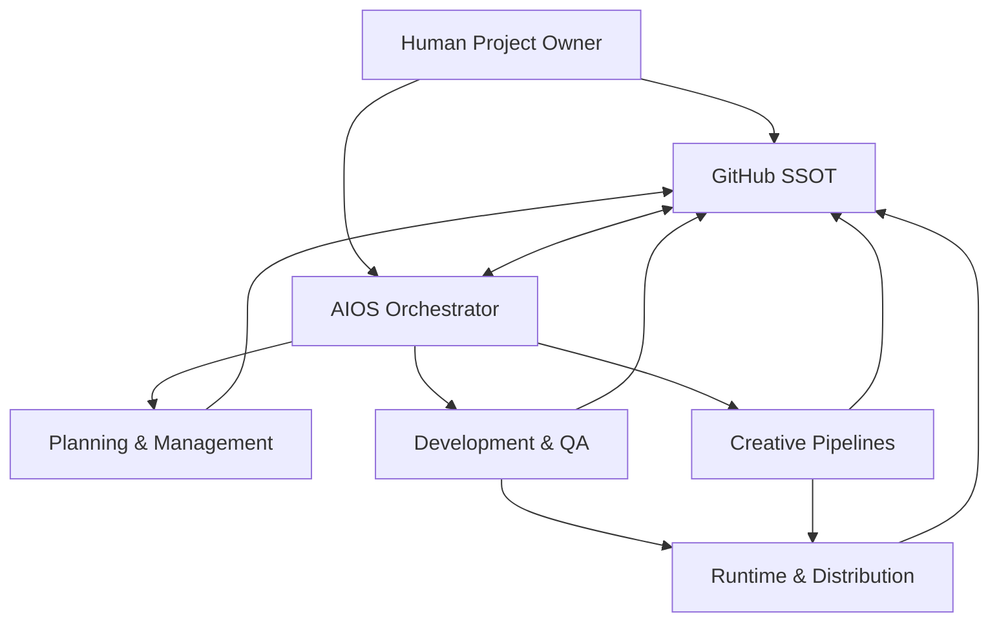

# Architecture

Version: 1.0.0  
Last Updated: 2026-08-24  
Status: Active

---

## 1. Purpose

本書は、AI Game Studioを構成するガバナンス、AIOS、制作機能、開発基盤、外部サービス、成果物の関係を定義する。

本書は目標構成を示す。実装済みの範囲は `Docs/04_PROJECT_STATUS.md` を正とし、目標構成を実装済みと解釈してはならない。

---

## 2. Architecture Principles

- GitHubのmainを承認済み情報のSSOTとする。
- AIOSは役割とタスクを調整し、人間の最終判断を代替しない。
- ゲーム固有部分と共通基盤を分離する。
- AIモデル、画像モデル、外部サービスを交換可能にする。
- 入出力、判断、生成条件、テスト結果を追跡可能にする。
- 秘密情報と課金操作を成果物から分離する。
- 外部サービス停止やセッション切断を前提に復旧点を持つ。
- 自動化できない工程にはHuman Fallbackを残す。

---

## 3. Logical Architecture



### Layers

| Layer | Responsibility |
|---|---|
| Human Governance | 最終判断、入力、予算、権利、セキュリティ、公開 |
| GitHub SSOT | 文書、コード、workflow、履歴、レビュー |
| AIOS Orchestration | タスク分解、役割割当、実行監督、合議、引継ぎ |
| Planning & Management | 企画、仕様、進行、調査、意思決定案 |
| Development & QA | Architecture、Unity、Firebase、テスト、ビルド |
| Creative Pipelines | UI/UX、キャラクター画像、Live2D、シナリオ |
| Runtime & Distribution | WebGL、iOS、Android、Steam、バックエンド |

---

## 4. AIOS Components

### Task Router

タスクの目的、成果物、必要能力、リスク、承認点を解析し、担当Roleへ割り当てる。

### Context Loader

`99_AI_CONTEXT.md`、Bootstrap、Status、Decision Log、関連文書、ゲーム別仕様を読み、必要な情報だけをタスクへ渡す。

### Planning Council Controller

Main Plannerと2名のReviewerを独立実行し、ラウンド数、Approve/Revise、未合意点を管理する。3ラウンドで未合意なら人間へエスカレーションする。

### Execution Controller

作業ブランチ、タスク状態、ツール操作、成果物、テスト、失敗、再試行を管理する。

### Review Controller

作成者とReviewerを分離し、仕様レビュー、Architectureレビュー、QA、人間承認の状態を管理する。

### Memory and Handover Controller

重要判断をDecision Log、長期知識をProject Memory、現在状態をStatus、セッション引継ぎをHandover、入口情報をContextへ反映する。

---

## 5. Repository and Git Architecture

- `main`：人間が承認した正式状態
- 作業ブランチ：AIまたは人間が変更を準備する状態
- Pull Request：差分、レビュー、承認、未解決事項を確認する場所
- Commit：目的を1つに絞った変更単位
- GitHub Actions：承認された自動テスト、ビルド、デプロイ
- GitHub Secrets：CIで必要な秘密情報。値は文書やログへ出さない

標準フロー：

```text
main → task branch → implement → test → independent review → human review → merge
```

---

## 6. Game Development Architecture

### Client

- Unity 6
- Unity Personalの利用条件を満たす範囲で使用
- UI、ゲームロジック、Live2D表示、ローカルデータ、API接続
- 共通テンプレートとゲーム固有コードを分離

### Backend

基本候補はFirebaseとする。

- Authentication：ユーザー認証
- Firestore：ゲーム・運用データ
- Cloud Functions：信頼境界が必要な処理
- Hosting：WebGL検証版の配信候補
- Storage：必要に応じたデータ・アセット保管

実際に利用するサービス、料金プラン、リージョン、保存データはタイトルごとに確認する。

### Build and Distribution

- WebGL：早期検証とブラウザテスト
- iOS：App Store
- Android：Google Play
- PC：Steam

外部公開、ストア申請、本番デプロイは人間承認後に実行する。

---

## 7. Creative Architecture

### UI/UX

```text
Game Requirement → User Flow → Wireframe → Visual Design → Unity UI → UX QA
```

状態、画面遷移、例外、操作方法を仕様化し、見た目だけの成果物にしない。

### Character Illustration

```text
Human Input
  → Colab Session Started by Human
  → ComfyUI + Stable Diffusion
  → Review / Repair / Layer Preparation
  → Human Approval
  → Asset Repository
```

生成条件と成果物のmanifestを保存する。セッションに依存する一時ファイルを正式資産にしない。

### Live2D

```text
Approved Character Design
  → Part Definition
  → Part Generation / Separation
  → Parameter Design / Creation
  → Cubism Validation
  → Unity Integration
  → Performance and Quality Review
```

AIが担当する目標範囲はパーツ制作とパラメーター設計・作成までである。Cubism操作、変形品質、物理演算、SDK連携は工程別に検証し、人間操作が必要な箇所を残す。

### Scenario

```text
Concept → Story Bible → Plot → Scene Outline → Draft → Review → Approved Text → Unity Data
```

本文とゲーム実装用データを分離し、IDで対応付ける。

---

## 8. Data and Artifact Contracts

### Task Specification

最低限、次を含む。

- Task ID
- Goal
- Inputs
- Outputs
- Scope / Non-Scope
- Related Documents
- Assigned Role
- Reviewers
- Human Approval Points
- Acceptance Criteria
- Cost / Tool Constraints
- Status

### Asset Manifest

- Asset ID
- Source / Input
- Tool / Model / Version
- Workflow Version
- Seed / Prompt / Parameters
- License / Terms Check
- Output Files
- Human Approval
- Related Game / Character
- Last Updated

### Scenario Manifest

- Scenario ID
- Story Bible Version
- Character Setting Version
- Plot Version
- Draft Version
- Review Status
- Human Approval
- Unity Output Path

### Model Registry Entry

`Docs/02_AI_ROLES.md`の必須項目に従う。

---

## 9. Security and Secrets

- APIキー、トークン、サービスアカウント、個人情報をGitHubへ直接保存しない。
- ローカル秘密情報は環境変数または承認されたSecret Storeを使う。
- GitHub ActionsではGitHub Secretsを使う。
- Colabではセッションまたは承認されたSecret機能を使い、Notebook出力へ値を残さない。
- ログ出力前に秘密情報をマスクする。
- 権限は必要最小限にする。
- 権限変更と新しい外部接続は人間承認を必要とする。

---

## 10. Cost Boundaries

有料処理はHuman-StartedまたはHuman-Approvedとして管理する。

- Colabセッション開始：Human-Started
- GPU種別や上位プラン変更：Human Approval
- API利用上限変更：Human Approval
- 本番ホスティング・バックエンド課金：Human Approval
- 大量生成・大量テスト：事前に概算と停止条件を提示

AIOSは処理開始時刻、対象、実行回数、成果物、停止理由を記録する。

---

## 11. Reliability and Recovery

- 外部セッション終了前に成果物と設定を永続化する。
- タスクは再開可能なcheckpointへ分割する。
- 同一原因の無制限再試行を禁止する。
- 失敗時は入力、ログ、部分成果物、再開手順を保存する。
- 外部サービス停止時はFallbackへ切り替えるかBLOCKEDとする。
- 破損の可能性がある場合は自動復旧を続けず、人間へ確認する。
- Project StatusとSession Handoverに復旧点を記録する。

---

## 12. Observability

各工程は、可能な範囲で次を記録する。

- Task IDと実行Role
- 開始・終了時刻
- 入出力
- 使用モデル、ツール、workflow
- 外部サービスと費用区分
- テスト結果
- Reviewerと判定
- 人間承認
- Commit / Pull Request
- 失敗と再試行

秘密情報、モデルの非公開思考、不要な個人情報は記録対象にしない。

---

## 13. Architecture Change Process

1. 変更理由と対象をPROPOSALとして作成する。
2. 現行構成、代替案、費用、移行、Rollbackを比較する。
3. Architectがレビューする。
4. セキュリティ、権利、費用への影響を確認する。
5. 人間が承認する。
6. 小さな作業ブランチで実装・検証する。
7. Decision Log、Architecture、Status、関連文書を更新する。
8. 人間承認後にmainへマージする。

---

## 14. Current Validation Gaps

次は目標構成であり、現時点で実装・検証済みではない。

- Antigravity 2.0によるAIOS全体の自動運用
- Unity CLI / MCP / Computer Use
- Firebase環境とGitHub Actionsの接続
- WebGL自動デプロイ
- Colab上のComfyUI遠隔操作
- Live2Dパーツ・パラメーター作成の自動化
- シナリオからUnityデータへの自動変換
- モデルレジストリの自動ルーティング

実装状況は本書ではなく `Docs/04_PROJECT_STATUS.md` で更新する。

---

End of Architecture.
