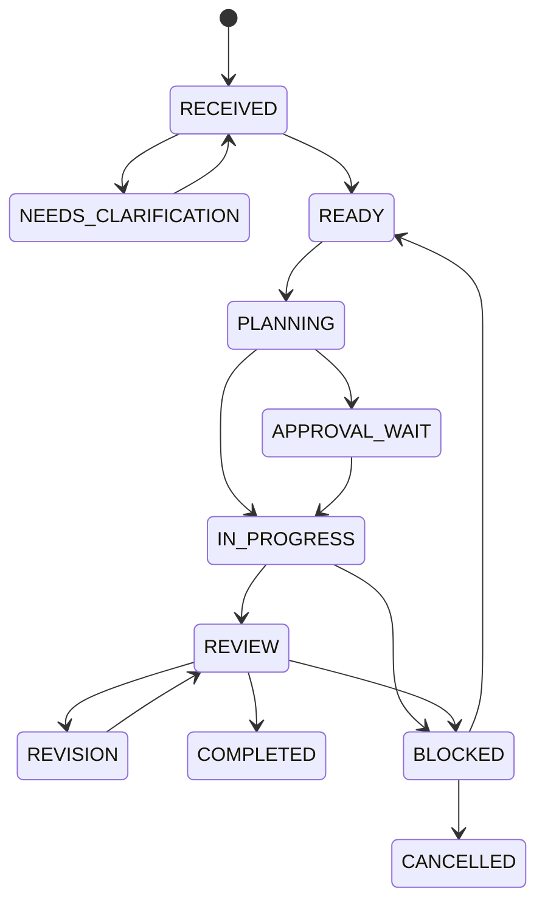

# AI Execution Protocol

Version: 2.0.0  
Last Updated: 2026-08-25  
Status: Active Design / Implementation Pending

---

## 1. Purpose

本書は、AIOSが依頼を受け、Contextを読み、Roleを割り当て、実行、Review、記録、引継ぎまで管理する標準手順を定義する。

個別タスクの入力形式と完了条件は `Docs/93_AI_TASK_PROTOCOL.md`、役割別の実践手順は `Docs/92_AI_PLAYBOOK.md` を参照する。

---

## 2. Execution States

Task状態の正規語彙とEntry / Exit Conditionは `Docs/93_AI_TASK_PROTOCOL.md` Section 5を正とする。本書も同じState名だけを使用する。



### State Definitions

| State | Meaning |
|---|---|
| RECEIVED | 依頼を受領した |
| NEEDS_CLARIFICATION | 結果が大きく変わる不足情報の回答待ち |
| READY | Context、Scope、Role、Riskを確認した |
| PLANNING | Scope、手順、Role、Review、承認点を定義中 |
| APPROVAL_WAIT | 人間承認なしに進められない |
| IN_PROGRESS | 承認済み範囲を実行中 |
| REVIEW | TestまたはIndependent Review中 |
| REVISION | Review指摘を修正中 |
| BLOCKED | 権限、情報、環境、能力、費用で停止 |
| COMPLETED | 完了条件、記録、Handoverを満たした |
| CANCELLED | 人間または正当な理由で中止 |

Stateを飛ばしてCOMPLETEDにしない。Execution LogとTask Packetの `status` もこの語彙を使用する。

---

## 3. Phase 0: Request Intake

AIOSは依頼から次を抽出する。

- Goal
- Deliverable
- Scope
- Non-Scope
- Target Repository / Game
- DeadlineまたはPriority
- Human Approval Points
- Cost Constraints
- Required Tools
- Expected Quality
- Destructive or External Actions
- Missing Information

結果が大きく変わる不足情報だけを人間へ確認する。安全に仮定できる小さな項目はASSUMPTIONとして記録する。

---

## 4. Phase 1: Context Loading

標準読込：

1. `Docs/99_AI_CONTEXT.md`
2. `Docs/00_AI_BOOTSTRAP.md`
3. `Docs/01_PROJECT_OVERVIEW.md`
4. `Docs/02_AI_ROLES.md`
5. `Docs/03_AI_RULES.md`
6. `Docs/04_PROJECT_STATUS.md`
7. `Docs/05_DECISION_LOG.md`
8. `Docs/12_SESSION_HANDOVER.md`
9. 現在タスクに必要なDomain文書
10. ゲーム別文書と成果物

すべての文書を常に全文読込する必要はないが、タスクへ関係する責任文書を省略しない。

Context確認結果：

- Applicable Decisions
- Current Branch / Version
- Known Risks
- Existing Work
- Conflicts
- Missing Documents
- Required Human Decisions

---

## 5. Phase 2: Risk Classification

| Risk | Examples | Execution Rule |
|---|---|---|
| Low | 文言修正、非破壊的調査、Draft作成 | 承認済みScope内で実行 |
| Medium | 新規File、通常Code変更、workflow更新 | 作業Branch + Review |
| High | Architecture、依存追加、外部接続、有料処理 | Plan + Human Approval |
| Critical | 削除、権限、Secrets、公開、Release、main merge | 明示承認まで停止 |

複数Riskがある場合は最も高いものを採用する。

---

## 6. Phase 3: Role Assignment

AIOSは `Docs/02_AI_ROLES.md` とモデルレジストリからRoleを選ぶ。

選定順：

1. 必要能力
2. Tool Access
3. StatusがActiveか
4. 入出力互換性
5. Independent Reviewを分離できるか
6. Cost / Latency
7. Fallback
8. Terms Last Verified

Candidate、Preview、Unvalidatedを利用する場合は明示する。

---

## 7. Phase 4: Planning

標準Planには次を含む。

- 現状
- 目標
- 変更対象
- 非対象
- 手順
- File / Tool
- Assigned Roles
- Reviewers
- Human Approval
- Test
- Rollback
- Completion Criteria

ゲーム企画・主要企画判断では、Main Plannerと2名のReviewerによる3者合議を実行する。

最大3ラウンドで未合意の場合：

1. 議論を停止する。
2. 選択肢を整理する。
3. 利点・欠点・Riskを整理する。
4. 合意点と未合意点を分ける。
5. 推奨案を示す。
6. 人間へ判断を求める。

---

## 8. Phase 5: Approval Check

実行前に次を確認する。

- Task Scopeが明確
- Human Approvalが必要か
- 有料処理か
- External Writeか
- Secret / Permissionを扱うか
- 削除・上書き・履歴書換えか
- mainへ影響するか
- Public Releaseか

必要な承認がない場合はAPPROVAL_WAITとし、先へ進まない。

---

## 9. Phase 6: Execution

### Standard Rules

- 作業Branchを使用する。
- 最新File / SHAを取得する。
- 小さなCheckpointへ分ける。
- 1変更1目的を維持する。
- 実行結果をその場で確認する。
- 失敗した操作を成功扱いにしない。
- Userが途中で追加・変更した指示をScopeへ反映する。
- 60秒以上かかる作業では進捗を共有する。
- 外部サービス費とSession状態を監視する。Colab TaskではAssigned Roleを監視責任者とし、自動監視できない場合は人間へ明示委任する。

### Tool Operations

- Read → Validate Target → Write → Re-read → Compare
- 同一FileへのWriteを並列実行しない。
- 書込後は実際の外部状態を再取得する。
- 認証失敗、権限拒否、承認要求はBLOCKEDとして扱う。
- 秘密情報をOutputやlogへ展開しない。

---

## 10. Phase 7: Review

Reviewは成果物の種類に応じて実行する。

- Specification Review
- Architecture Review
- Code Review
- Asset Review
- Scenario Review
- QA
- Security / Rights Review
- Human Review

Review結果は次の形式とする。

```text
Scope:
Method:
Findings:
Severity:
Required Changes:
Untested:
Decision: APPROVE | REVISE | BLOCK
```

作成者自身のReviewだけでAPPROVEにしない。

---

## 11. Revision Loop

- 指摘をFinding IDで管理する。
- 各Findingを `FIXED`、`REJECTED_WITH_REASON`、`PENDING_HUMAN`、`DEFERRED` のいずれかで処理し、根拠を記録する。
- 修正した内容と未対応理由を記録する。
- Review終了後は同一Task内でProject StatusとSession Handoverを更新し、方針決定を伴う場合のみDecision Logも更新する。
- Scope外の改善は別Taskへ分ける。
- 同じ原因の失敗を2回繰り返した場合は方法を変更する。
- Reviewと修正が循環する場合は、人間へ論点を提示する。
- 企画の合議ラウンド数は最大3回を超えない。

---

## 12. Completion

COMPLETEDに必要な条件：

- Deliverableが存在する。
- Acceptance Criteriaを満たす。
- 必要なTestとReviewが完了している。
- 未確認範囲が記録されている。
- Human Approvalが必要な項目を越えていない。
- Decision / Status / Memoryを必要に応じて更新した。
- HandoverとContextを更新した。
- Branch、Commit、File、次のActionを報告できる。

---

## 13. Documentation Updates

| Event | Update |
|---|---|
| 重要判断 | `05_DECISION_LOG.md` |
| 進捗・Blocker・次Task | `04_PROJECT_STATUS.md` |
| Architecture変更 | `06_ARCHITECTURE.md` |
| Asset工程変更 | `07_ASSET_PIPELINE.md` |
| Scenario工程変更 | `08_SCENARIO_PIPELINE.md` |
| QA / Release変更 | `09_QA_RELEASE_POLICY.md` |
| Structure変更 | `10_REPOSITORY_STRUCTURE.md` |
| 永続的学習 | `11_PROJECT_MEMORY.md` |
| Session再開情報 | `12_SESSION_HANDOVER.md` |
| 現在地 | `99_AI_CONTEXT.md` |

---

## 14. Blocked Protocol

BLOCKED時は次を出力する。

- Blocker
- Impact
- Completed Before Block
- Data / Files at Risk
- Safe Options
- Human Decision Required
- Restart Point
- Whether Cost Is Continuing

課金中、外部公開中、データ破損中など時間依存のRiskは最優先で人間へ知らせる。

---

## 15. Cancellation

Cancelled時も次を行う。

- 途中成果物をDraftとして保存する。
- 実行済みのExternal Actionを記録する。
- 課金やSessionを安全に停止する。
- Revertが必要か確認する。
- StatusとHandoverを更新する。
- Secretsを残さない。

---

End of AI Execution Protocol.
